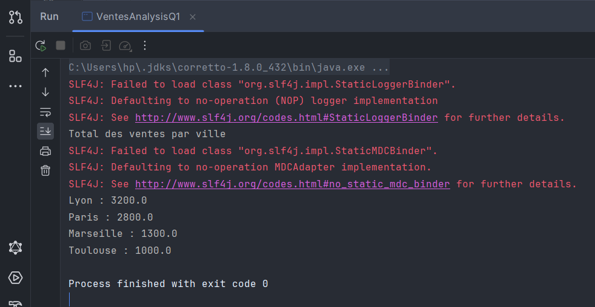
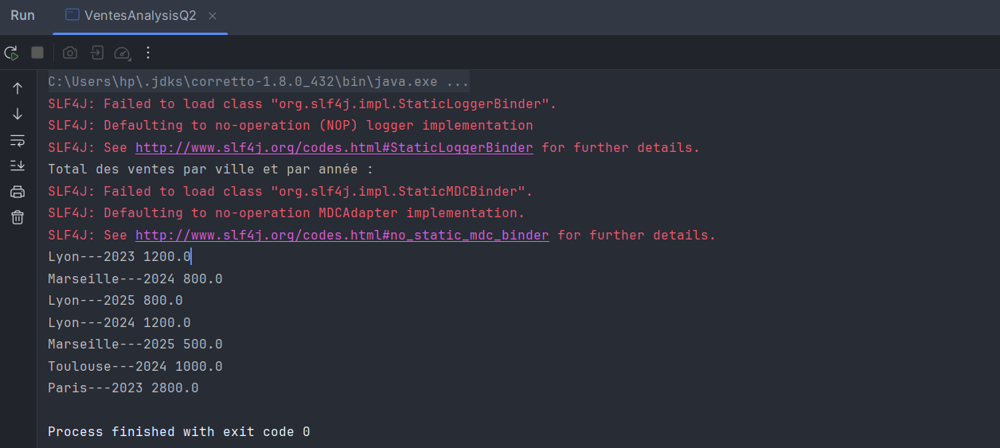

# TP Apache Spark : Analyse des Ventes

## Objectif

L'objectif de ce TP était de créer une application Apache Spark pour :

- Lire des données de ventes depuis un fichier texte (`ventes.txt`).
- Calculer le total des ventes par ville.
- Calculer le total des ventes par ville pour une année donnée.
- Afficher les résultats à la fin de l'exécution.

## Structure du Projet

### Fichiers Principaux

- **`ventes.txt`** : Fichier texte contenant les données de ventes.
- **`VentesAnalysisQ1.java`** : Classe pour calculer le total des ventes par ville.
- **`VentesAnalysisQ2.java`** : Classe pour calculer le total des ventes par ville pour une année donnée.

### Données

Le fichier `ventes.txt` contient les colonnes suivantes :

- `date` : Date de la vente.
- `ville` : Ville où la vente a eu lieu.
- `produit` : Produit vendu.
- `prix` : Montant de la vente.

Exemple de contenu :
```csv
date       ville produit    prix
2023-10-01 Paris Ordinateur 1200
2025-10-01 Lyon Smartphone  800
2025-10-02 Marseille Tablette 500
2023-10-02 Paris Smartphone  800
2024-10-03 Lyon Ordinateur  1200
2024-10-03 Toulouse Tablette 500
2023-10-04 Paris Smartphone  800
2023-10-04 Lyon Ordinateur  1200
2024-10-05 Marseille Smartphone 800
2024-10-05 Toulouse Tablette 500
```


## Résultats

### 1. Total des Ventes par Ville

Les résultats du calcul du total des ventes par ville sont affichés dans la console.



### 2. Total des Ventes par Ville pour une Année Donnée

Les résultats du calcul du total des ventes par ville pour une année  sont affichés dans la console.


